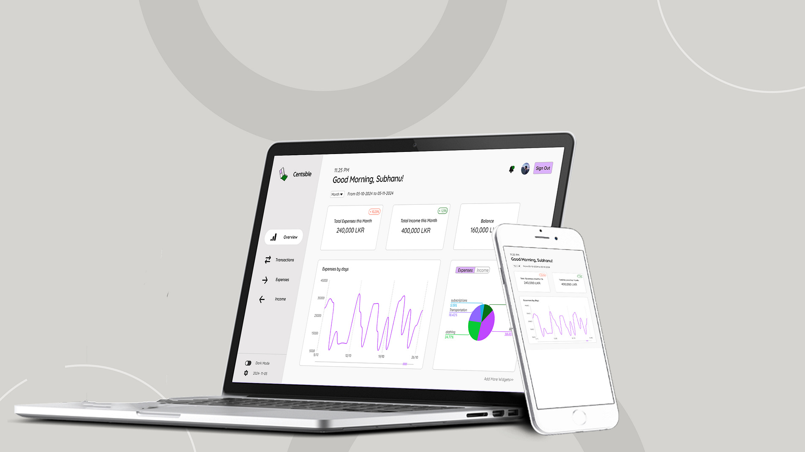
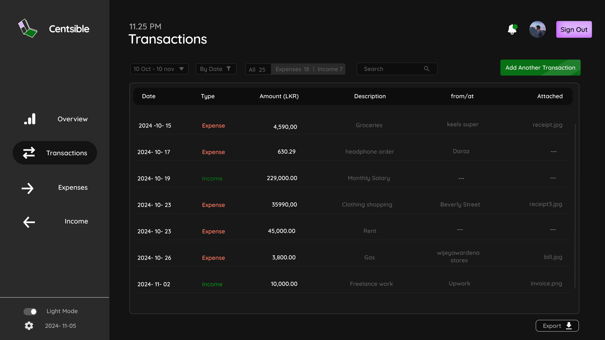
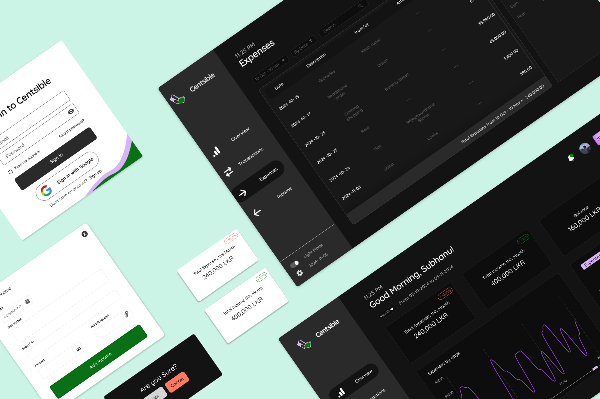
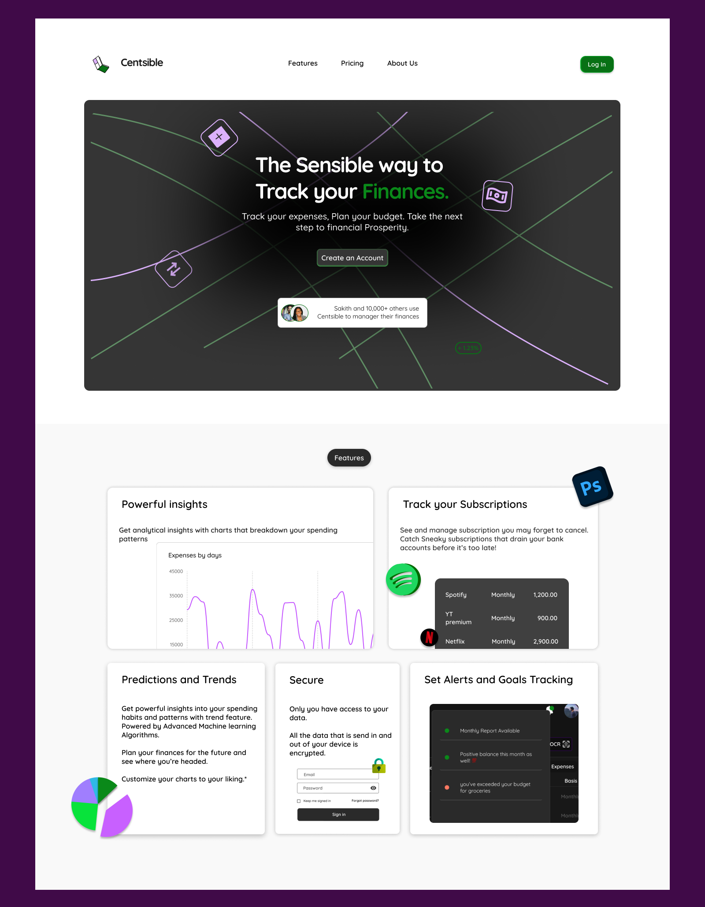

# Centsible - Personal Finance Tracker UI Prototype 💸

Dribbble design Shot: https://dribbble.com/shots/25167466-Personal-Finance-Tracker-Centsible

Centsible ➡️ The Sensible Way to Track Your Finances.

A personal finance tracker that allows users to track their spending and income. Track expenses, income, see insights broken down by category, dark mode and more. The goal was to create a minimal yet vibrant interface that makes managing finances feel effortless and accessible.

**Features**

  📊 Expense tracking for different categories  
  💸 Set alerts and see your cash flow  
  🎯 See expenses and income broken down separately  
  ⚡OCR to scan receipts and add entries easily  
  ⬇️Export your data as csv and in other formats  
  📅 reports with graphs for easy analysis with filtering by days and other params  
  🔐Secure authentication

**Tech Used** 

### Product Landing page

Dribbble design shot : https://dribbble.com/shots/25253473-Landing-Page-Hero-for-Personal-Finance-Tracker-Centsible

---
Made with ❤️ by [Subhanu](https://github.com/subhanu-dev)
